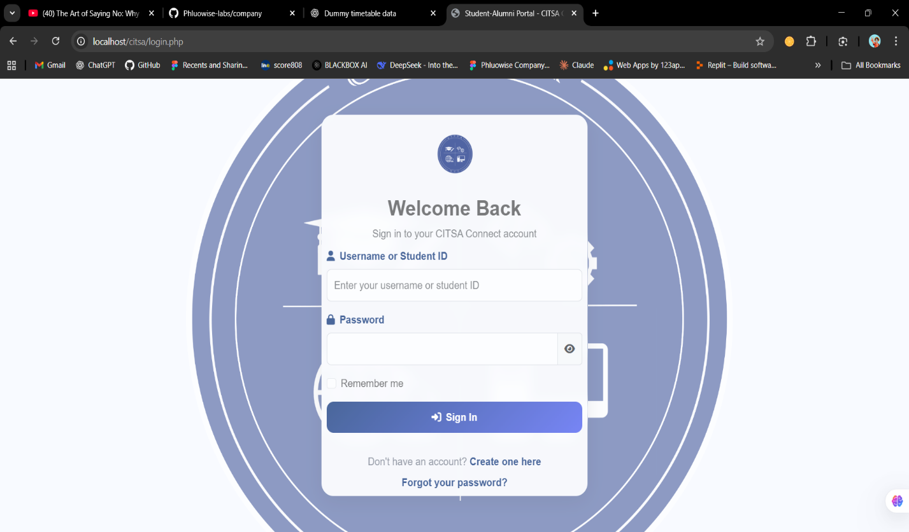
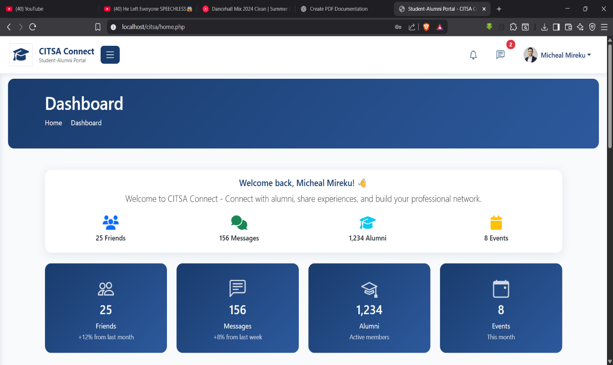
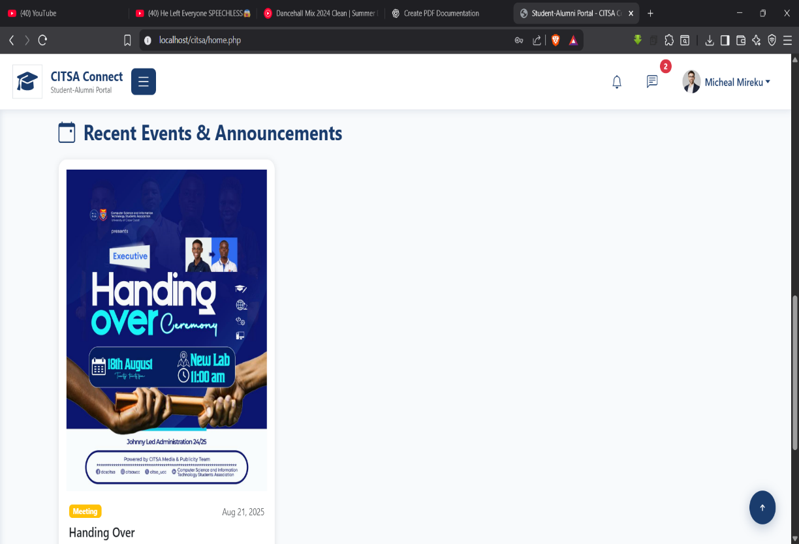
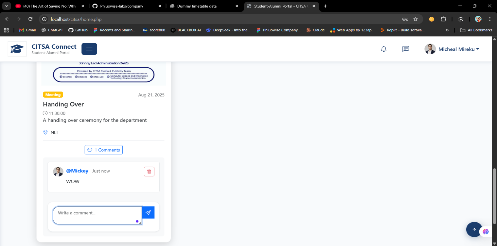

🚀 CITSA Alumni Connect

**A modern alumni–student networking platform built for real communities**

CITSA Alumni Connect is a **full-stack web application** designed to keep **students and alumni connected long after graduation**.
It replaces scattered WhatsApp groups and forgotten Facebook pages with a **secure, structured, and scalable platform** for mentorship, events, and professional networking.

Built with **PHP, MySQL, Bootstrap, and OTP-based authentication**, this project demonstrates real-world system design, role-based access control, and community-focused product thinking.

 👀 Why This Project Matters 

Most alumni platforms fail because they’re:

* static
* boring
* fundraising-first
* zero student–alumni interaction

**CITSA Alumni Connect fixes that.**

It automatically transitions users from **student → alumni**, keeps engagement alive, and turns events into **interactive discussion hubs**, not just posters.

If you’re looking for:

* real authentication logic
* role-based dashboards
* secure backend workflows
* clean UI + UX decisions

## 🧠 Core Features

### 🔐 Authentication (OTP + Password)

* First-time users verify identity via **OTP (SMS-based)**
* Returning users log in normally
* Secure sessions & hashed passwords
* Automatic **Student vs Alumni classification**

### 🎓 Student Experience

* View announcements & events
* Stay connected while in school
* Seamless transition into alumni status after graduation

### 🧑‍💼 Alumni Experience

* Alumni-only dashboard
* Professional networking
* Comment and engage on events
* Mentorship-style interactions with students

### 📅 Events That Actually Engage

* Admin-posted events
* Alumni discussion threads under each event
* Event history = community memory

### 🛠️ Admin Controls

* Manage users
* Post announcements & events
* Moderate discussions
* Oversee platform activity

---

## 🧱 System Architecture

Built using a **clean 3-tier architecture**:

* **Frontend:** HTML, CSS, Bootstrap 5, JavaScript
* **Backend:** PHP
* **Database:** MySQL

Designed for **scalability**, **maintainability**, and future mobile expansion.

---

## 🛠 Tech Stack (Recruiter-Friendly)

| Layer           | Tools                              |
| --------------- | ---------------------------------- |
| Frontend        | HTML, CSS, Bootstrap 5, JavaScript |
| Backend         | PHP                                |
| Database        | MySQL                              |
| Auth            | OTP (SMS-based)                    |
| APIs            | Africa’s Talking / Twilio          |
| Dev Tools       | XAMPP, VS Code                     |
| Version Control | Git & GitHub                       |

---

## 🖼️ UI Preview

### 🔐 Authentication

### 🧑‍💼 Alumni Dashboard

### 📅 Events & Engagement

## 🔒 Security Highlights

* Password hashing (`password_hash`)
* OTP expiration & single-use validation
* Prepared SQL statements
* Session-based access control
* Role-based feature restrictions

---

## 🧪 Testing & Stability

* Unit & integration testing
* User Acceptance Testing (students + alumni)
* Mobile responsiveness testing
* Access control & session protection verified

Stable under moderate concurrent usage.

---

## 🔮 Planned Upgrades

* Alumni job board & referrals
* Mentorship matching system
* Event registration & RSVP tracking
* Engagement analytics dashboard
* Android & iOS mobile apps
* Push notifications

---

## 👨‍💻 Contributors

* Micheal Mireku
* Nyarko Olivia Emefa
* Nguandi Thomas
* Abdul Manaf Musah
* Eden Kofi Ofori

---

## 📜 License

Academic project — University of Cape Coast
Department of Computer Science & Information Technology
